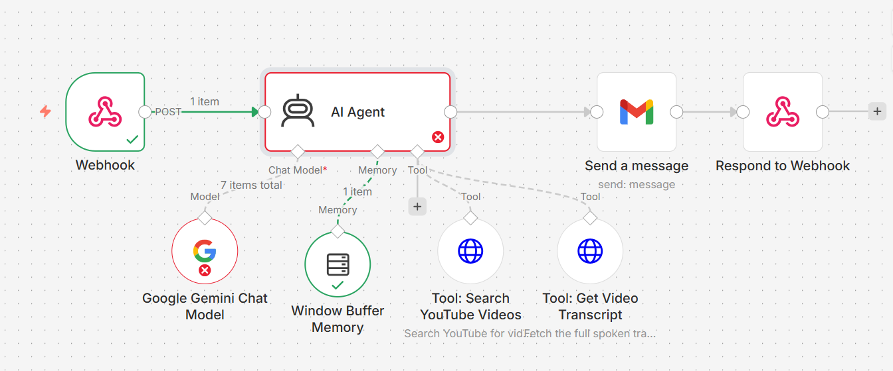
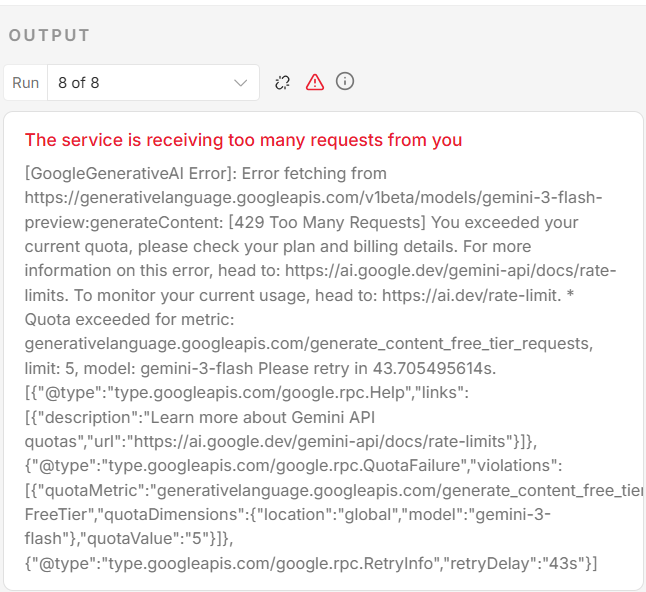
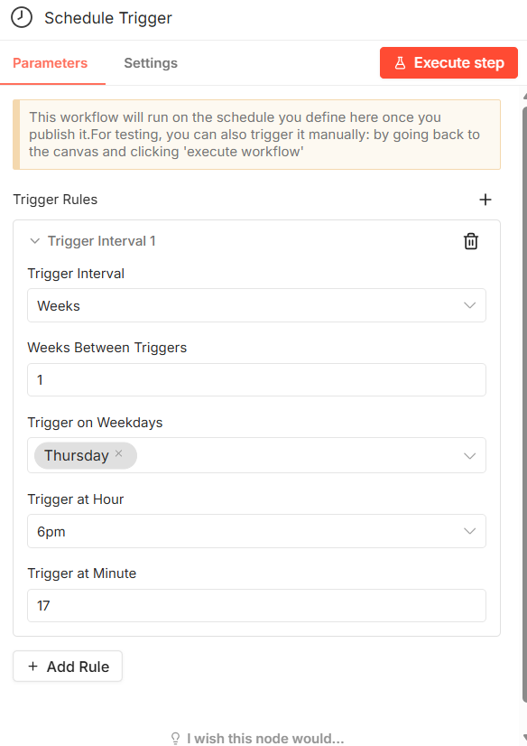
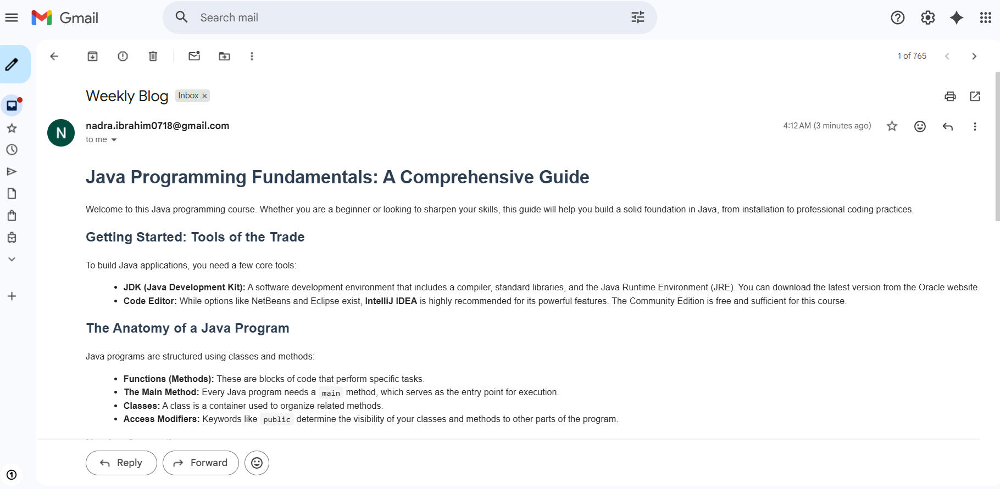

# Weekly Topic Update Agent Linear Approach(Not to be refernced for Assignment Submission)

## Overview
This n8n workflow automatically finds weekly YouTube videos on a topic of interest, extracts the transcript, converts it to formatted HTML, and emails it to you.

**Note on Implementation**: I initially tried building a full AI agent with multiple tools and memory nodes, but was not able to run atleast once, there always persist an issue. Still I have added the workflow file in the Failed Workflow Folder. In the failed workflow, the agent was using the tools and memory to curate the better responses. 

**Issue**:  The failed workflow was hitting the Google Gemini free-tier quota limit (429 "Too Many Requests" error with a limit of 5 free requests). The complex agent setup with multiple tool calls and the Window Buffer Memory node was consuming my quota too quickly. **Hence, I had to remove the tools and memory and moved from a complex agent-driven architecture to a simpler linear pipeline.**

---

## Workflow Nodes

**Schedule Trigger** - Runs the workflow every Thursday at 6:17 PM

**Set Node** - Sets the topic to search for (e.g., "AI")

**HTTP Request (YouTube Search)** - Finds YouTube videos about the topic

**HTTP Request (Video Details)** - Gets video duration and view counts

**JavaScript Code** - Filters videos longer than 15 minutes and sorts by popularity

**HTTP Request (Transcript)** - Extracts the video transcript

**AI Agent + Google Gemini** - Converts transcript to clean HTML format

**Gmail** - Sends the HTML blog via email

---

## Memory Used

This workflow doesn't use a traditional memory node. Instead, data flows through each step in sequence. The transcript and video info are passed forward until the final email is sent. 

I tried using a Window Buffer Memory node but ran into free-tier limitations, so this linear pipeline works better.

---

## Workflow Screenshot

---

## Agent in Action

### Screenshot 1: Scheduled Execution Triggered

### Screenshot 2: Video Selection and Filtering

### Screenshot 3: Transcript Conversion to HTML

### Screenshot 4: Email Delivery

---

## Reflection

### What Does Your Agent Do Well?
- Finds relevant videos reliably each week
- Video filtering logic (duration + view count) actually works
- Transcript extraction is usually accurate
- HTML formatting is clean and readable
- Email delivery is consistent

### What Are Its Current Limitations?
- Single topic only - need separate workflows for different interests
- Topic and schedule are hardcoded in the workflow
- Sometimes videos don't have usable transcripts
- YouTube API rate limits can cause issues
- Google API keys and secrets could expire soon

### What Would You Improve or Extend?
- Most Importantly. I should get the reliable access to LLM, so that my agent could use the HTTP request tool, gmail tool and memory. And i will eventually be able to remove the nodes and the agent could cover the whole flow itself. 
- Add a configuration interface instead of hardcoding values
- Support multiple topics in one workflow
- Better error handling when transcripts are unavailable
- Track which emails get read to improve suggestions

### How Does Memory Improve the Agent's Usefulness?
I haven't used memory in this workflow because it's scheduled and automated—not conversational. But if I had built an interactive agent, memory would help by:
- Remembering what the user asked for in previous messages
- Keeping consistent settings and preferences across multiple requests
- Learning what content the user actually finds useful

For a workflow like mine that runs once a week and sends an email, memory isn't needed. The data just flows through and gets sent out. 

### Did the Tool Behave as Expected?
- **YouTube Search API**: Worked reliably, consistently returning relevant results
- **Transcript Extraction**: Successfully converted videos to readable transcripts
- **AI Formatting**: Google Gemini consistently produced clean HTML with proper structure
- **Gmail Delivery**: Reliable email sending without delivery issues
- **Edge Cases Observed**:
  - Some videos unavailable for transcript extraction (restricted or deleted content)
  - Occasionally returns videos without transcripts; workflow completes but email content is incomplete
  - YouTube API rate limits could cause timeout if multiple topics configured
  - Very long transcripts may exceed token limits for the LLM

---
