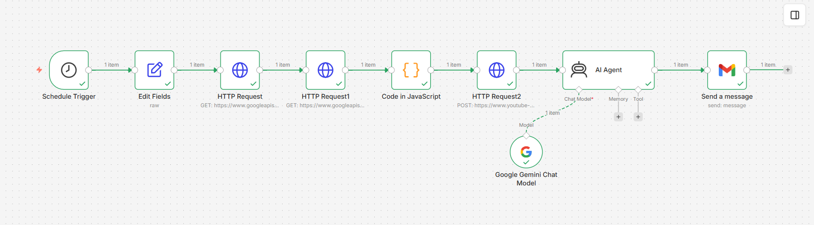
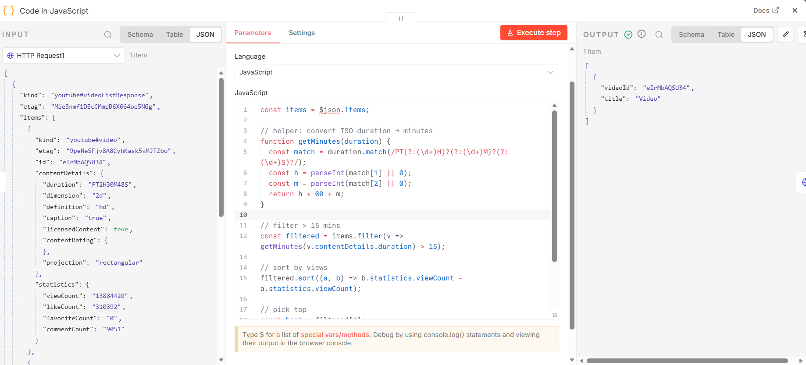
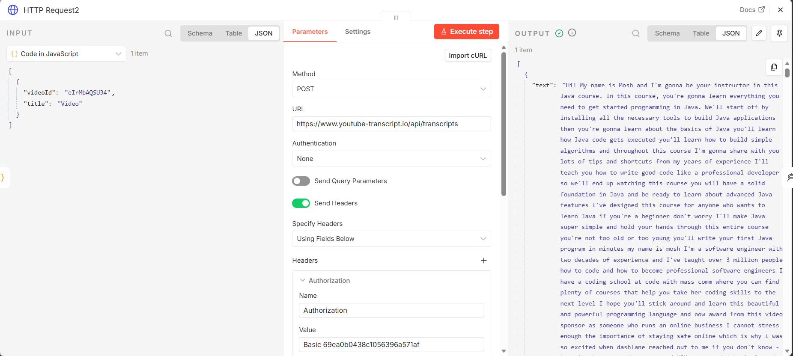
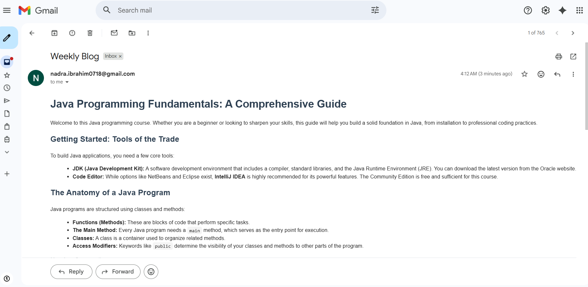

# Weekly Topic Update Agent

## Overview
This n8n workflow automatically finds weekly YouTube videos on a topic of interest, extracts the transcript, converts it to formatted HTML, and emails it to you.

**Note on Implementation**: I initially tried building a full AI agent with multiple tools and memory nodes, but hit limitations with free-tier API quotas. This workflow is a simpler, working alternative that runs reliably on free versions.

## Use Case

### Problem 
It's hard to keep up with new content on topics you care about. This workflow finds the best educational videos weekly and delivers them as readable summaries.

### Primary User
- Anyone trying to stay updated on a specific topic
- Students who want curated learning materials
- People with limited time for research

### Example Inputs
The agent runs autonomously on a weekly schedule. Users configure it once with their topic of interest:
1. Topic: "Artificial Intelligence" - Gets the best AI video each week
2. Topic: "Python Programming" - Delivers the top Python tutorial weekly
3. Topic: "Machine Learning" - Curates ML research and tutorials
4. Topic: "Cloud Computing" - Sends AWS/Azure/GCP updates every Thursday
5. Topic: "Data Science" - Delivers data science insights on schedule

---

## LLM Used

### Model Selection
**Google Gemini 3.1 Flash Lite (Google)**

### Rationale
- **Fast Processing**: Flash model provides rapid response times ideal for scheduled workflows running on a fixed timetable
- **Cost-Efficient**: Lite variant reduces operational costs for weekly automated processes
- **Strong Text Comprehension**: Excels at understanding transcript content and formatting it as clean HTML
- **Reliable Formatting**: Consistently produces well-structured HTML output with proper headings and formatting

---

## Workflow Nodes

**Schedule Trigger** - Runs the workflow every Thursday at 6:17 PM

**Set Node** - Sets the topic to search for (e.g., "AI")

**HTTP Request (YouTube Search)** - Finds YouTube videos about the topic

**HTTP Request (Video Details)** - Gets video duration and view counts

**JavaScript Code** - Filters videos longer than 15 minutes and sorts by popularity

**HTTP Request (Transcript)** - Extracts the video transcript

**AI Agent + Google Gemini** - Converts transcript to clean HTML format

**Gmail** - Sends the HTML blog via email

---

## Memory Used

This workflow doesn't use a traditional memory node. Instead, data flows through each step in sequence. The transcript and video info are passed forward until the final email is sent. 

I tried using a Window Buffer Memory node but ran into free-tier limitations, so this linear pipeline works better.

---

## Workflow Screenshot

---

## Agent in Action

### Screenshot 1: Scheduled Execution Triggered

### Screenshot 2: Video Selection and Filtering

### Screenshot 3: Transcript Conversion to HTML

### Screenshot 4: Email Delivery

---

## Reflection

### What Does Your Agent Do Well?
- Finds relevant videos reliably each week
- Video filtering logic (duration + view count) actually works
- Transcript extraction is usually accurate
- HTML formatting is clean and readable
- Email delivery is consistent

### What Are Its Current Limitations?
- Single topic only - need separate workflows for different interests
- Topic and schedule are hardcoded in the workflow
- Sometimes videos don't have usable transcripts
- YouTube API rate limits can cause issues
- Google API keys and secrets could expire soon

### What Would You Improve or Extend?
- Most Importantly. I should get the reliable access to LLM, so that my agent could use the HTTP request tool, gmail tool and memory. And i will eventually be able to remove the nodes and the agent could cover the whole flow itself. 
- Add a configuration interface instead of hardcoding values
- Support multiple topics in one workflow
- Better error handling when transcripts are unavailable
- Track which emails get read to improve suggestions

### How Does Memory Improve the Agent's Usefulness?
I haven't used memory in this workflow because it's scheduled and automated—not conversational. But if I had built an interactive agent, memory would help by:
- Remembering what the user asked for in previous messages
- Keeping consistent settings and preferences across multiple requests
- Learning what content the user actually finds useful

For a workflow like mine that runs once a week and sends an email, memory isn't needed. The data just flows through and gets sent out. 

### Did the Tool Behave as Expected?
- **YouTube Search API**: Worked reliably, consistently returning relevant results
- **Transcript Extraction**: Successfully converted videos to readable transcripts
- **AI Formatting**: Google Gemini consistently produced clean HTML with proper structure
- **Gmail Delivery**: Reliable email sending without delivery issues
- **Edge Cases Observed**:
  - Some videos unavailable for transcript extraction (restricted or deleted content)
  - Occasionally returns videos without transcripts; workflow completes but email content is incomplete
  - YouTube API rate limits could cause timeout if multiple topics configured
  - Very long transcripts may exceed token limits for the LLM

---

## Core Concept Questions

### 1. What is the difference between a simple LLM call and an LLM-powered agent?

A simple LLM call is one question → one answer. An LLM agent can:
- Use multiple tools (APIs, code, etc.) to solve problems
- Decide which tools to use based on the task
- Remember context across multiple steps
- Chain operations together

In this workflow, the agent doesn't really decide anything—it's more of a pipeline that coordinates different tools in sequence.

### 2. What role does the system prompt play in shaping agent behaviour?

The system prompt tells the LLM what to do and how to act. In this case, I tell Google Gemini: "Convert transcripts to clean HTML with headings and no markdown." 

A good system prompt makes the output consistent. A vague one gets messy results. I'm still learning how to write effective prompts.

### 3. How does tool use extend what an LLM can do on its own?

An LLM alone can only use information from its training data. Tools let it access new information and perform actions:
- YouTube API gives it real-time video data
- Code execution lets it filter and process that data
- Gmail sends emails out into the world

Without these tools, the LLM couldn't do anything beyond text generation.

### 4. What are the trade-offs between short-term (window buffer) and long-term (database) memory?

**Window Buffer**: Keeps last N messages in memory. Fast, cheap, but forgets everything when the conversation ends.

**Database Memory**: Stores everything forever. Costs more, slightly slower, but you never lose history.

For this workflow, neither is really needed because it's not conversational. It just runs once a week and sends an email.

### 5. What is the purpose of the AI Agent node in n8n compared to a simple LLM Chain node?

The AI Agent node can:
- Automatically choose which tools to use
- Work with memory nodes
- Make decisions based on the input
- Iterate and refine results

An LLM Chain just passes data from one LLM to another. It's simpler but less flexible.

For my workflow, I'm mostly just using the AI Agent as a formatter, not for autonomous decision-making.

### 6. What risks or failure modes did you observe when testing your agent?

- **API Rate Limits**: YouTube API throws errors if called too frequently
- **Missing Transcripts**: Some videos don't have transcripts; workflow still sends email but with incomplete content
- **Token Limits**: Very long transcripts sometimes exceed Gemini's limits
- **Hallucinations**: If a transcript is poor quality, the LLM sometimes fabricates content
- **Time Zones**: The schedule is hardcoded UTC, so timing might be off in other zones

I learned that you need fallback plans for when things fail, not just optimistic code.

### 7. How would you evaluate whether your agent is performing well in a real production setting?

**Track these metrics:**
- Does it run every week without errors?
- Are the videos actually relevant to the topic?
- Do the emails actually get delivered?
- Is the HTML formatting clean and readable?
- How long does the whole process take?

**For user value:**
- Do people actually read the emails?
- Do they find the content useful?
- Would they pay for this service?

I'm learning that shipping something simple and measuring real usage is better than perfecting it in isolation.

---
