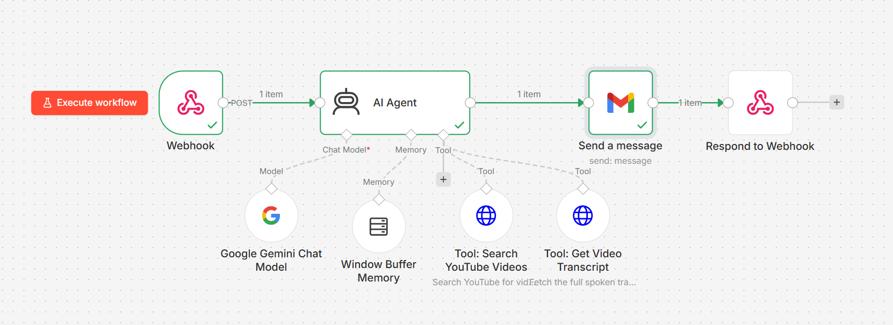
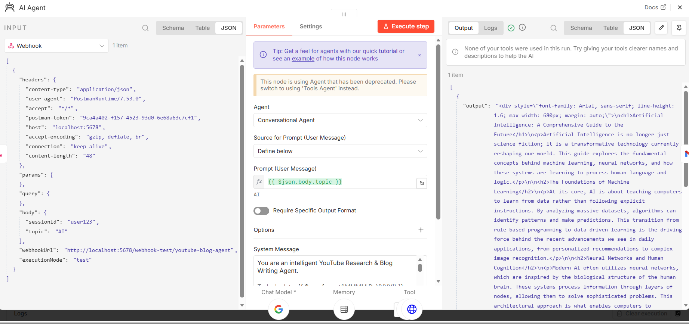
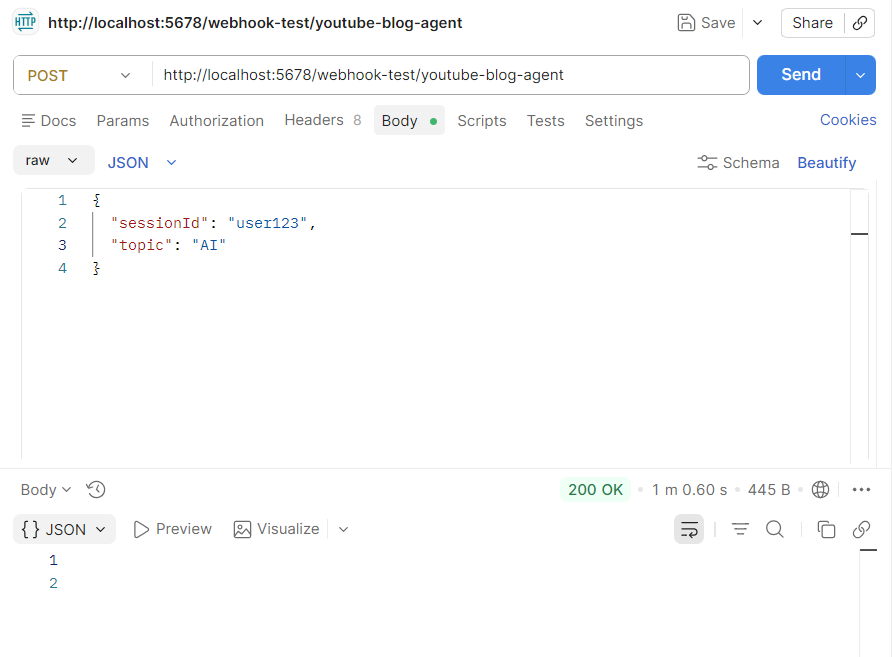
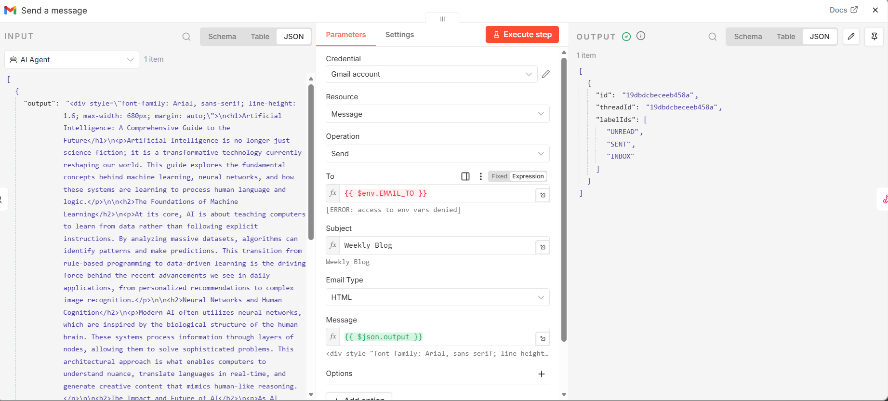

# Blog Generation from Trending YouTube Videos - AI Agent Workflow

## Overview
This n8n workflow implements an **intelligent AI-powered agent** that finds trending YouTube videos on a given topic, extracts transcripts, converts them into engaging HTML blog posts, and delivers them via email. The workflow is driven by a conversational AI agent with memory and tool integration, triggered via webhook.

**Architecture Update**: The workflow now uses a **full agent-driven architecture** with LLM-powered reasoning, persistent session memory, and multi-step tool orchestration. This replaces the previous linear pipeline approach, enabling more intelligent decision-making and context awareness.

## Use Case

### Problem 
It's hard to keep up with new content on topics you care about. This workflow intelligently searches for and curates the best educational videos, converting them into readable blog summaries on-demand.

### Primary User
- Anyone wanting on-demand curated video summaries
- Students who want AI-powered learning material generation
- Content researchers needing quick video-to-blog conversions
- People with limited time for video research

### How It Works
The agent operates through a **conversational interface** via webhook. Users send a request with their topic of interest, and the AI agent:
1. **Reasons about the topic** and decides which videos to search for
2. **Remembers previous searches** in the session to avoid repetition
3. **Intelligently filters** videos by duration (>15 min) and popularity (>100k views)
4. **Adapts dynamically** if transcripts are unavailable, trying alternative videos
5. **Generates professional HTML** blog posts from video transcripts

### Example Scenarios
- Send: `{ "sessionId": "user123", "topic": "Artificial Intelligence" }`  
  Response: HTML blog post on latest AI trends
  
- Send: `{ "sessionId": "user123", "topic": "Python Programming" }`  
  Response: HTML tutorial blog from top Python video
  
- Send: `{ "sessionId": "user123", "topic": "Machine Learning" }`  
  Response: ML research blog if available, or suggests related topic
  
- **Session Memory**: If the same user asks for "Artificial Intelligence" again in the same session, the agent recognizes it and suggests a related topic instead

---

## LLM Used

### Model Selection
**Google Gemini 3.1 Flash Lite (Google)**

### Rationale
- **Fast Processing**: Flash model provides rapid response times ideal for scheduled workflows running on a fixed timetable
- **Cost-Efficient**: Lite variant reduces operational costs for weekly automated processes
- **Strong Text Comprehension**: Excels at understanding transcript content and formatting it as clean HTML
- **Reliable Formatting**: Consistently produces well-structured HTML output with proper headings and formatting

---

## Workflow Architecture

### Entry Point
**Webhook Trigger** - Receives POST requests with JSON body:
```json
{
  "sessionId": "user123",
  "message": "Find me top AI videos this week"
}
```

### Agent & Memory System
**Conversational AI Agent** - The core orchestrator powered by Google Gemini 3.1 Flash Lite:
- Receives topic from webhook
- Uses the system prompt to reason about which tools to invoke and in what order
- Maintains context across multiple tool calls
- Makes intelligent decisions about video selection and transcript retrieval

**Window Buffer Memory** - Stores the last 20 conversation turns per session:
- Records all topics searched by a user
- Prevents duplicate topic searches within a session
- Enables the agent to suggest alternative topics if a user repeats a search
- Improves user experience through context awareness

### Agent Tools (Autonomous Tool Usage)
The AI agent has access to three specialized tools:

1. **Search YouTube Videos Tool**
   - Queries YouTube API for videos on the given topic
   - Filters for results with high view counts
   - Returns video IDs, titles, channels, and metadata
   - Agent decides which videos to investigate further

2. **Get Video Transcript Tool**
   - Fetches full transcripts from selected videos
   - Handles videos without available transcripts gracefully
   - Agent tries alternative videos if transcript unavailable
   - Returns clean text ready for blog generation

3. **Google Gemini Chat Model**
   - Converts video transcripts into professional HTML blog posts
   - Applies consistent formatting with proper structure
   - Adds catchy titles, sections, and key takeaways
   - Ensures clean HTML suitable for email delivery

### Output Delivery
**Gmail Node** - Sends the generated HTML blog post via email

**Webhook Response** - Returns completion status to the caller

---

## Setup & Configuration

### Required API Keys
1. **Google YouTube API Key** - Set as `YOUTUBE_API_KEY` environment variable
2. **YouTube Transcript API** - Hosted endpoint with authorization key set as `TRANSCRIPT_API_KEY`
3. **Google Gemini API Key** - For the LLM model (configured in n8n credentials)
4. **Gmail OAuth2** - For email delivery


### Making Requests
Send a POST request to your n8n webhook:
```
POST /webhook/youtube-blog-agent
Content-Type: application/json

{
  "sessionId": "user123",
  "topic": "Artificial Intelligence"
}
```

The agent will:
1. Search for relevant videos
2. Check transcripts availability
3. Generate an HTML blog post
4. Email the result
5. Return a success response

---

## How the Agent Reasons

The AI agent uses its system prompt to autonomously decide:
- **Which videos to prioritize** based on view counts and duration
- **Whether to retry** if a transcript isn't available
- **How to structure** the HTML blog post for readability
- **When to inform the user** of issues (e.g., no transcripts found)
- **How to remember** previous searches to avoid duplication

This agentic approach enables the workflow to **handle edge cases intelligently** rather than relying on hardcoded logic.

---

## Workflow Visualization

### Complete Workflow Architecture
The full n8n workflow showing all nodes connected: webhook trigger → AI Agent → tools → Gmail delivery.



### AI Agent Node Configuration
The core agent node with system prompt that orchestrates tool usage and memory integration.



### Webhook-Triggered Execution
The workflow being invoked via webhook with a topic request, triggering the agent to start processing.



### Email Delivery
The generated HTML blog post being sent via Gmail to the recipient.


### Send Email Node
Details of the email node configuration showing HTML content delivery and recipient setup.



---

## Reflection

### Evolution of the Workflow

**Initial Approach (Failed)**: Attempted a full agent-driven architecture but hit Google Gemini free-tier quota limits (429 errors with max 5 free requests).

**Second Iteration (Linear Pipeline)**: Removed agent reasoning and memory, replaced with fixed logic nodes. This worked but was inflexible and couldn't handle edge cases well.

**Current Implementation (Agent + Tools + Memory)**: Successfully implements the original vision:
- ✅ Conversational AI agent makes intelligent decisions
- ✅ Window Buffer Memory tracks session history
- ✅ Tools (YouTube Search, Transcript Fetch) are autonomously invoked
- ✅ Graceful handling of missing transcripts
- ✅ Dynamic topic suggestions to avoid repetition
- ✅ Professional HTML generation with consistent formatting

### Key Strengths
- **Intelligent Reasoning** - Agent adapts behavior based on results, not just following fixed steps
- **Session Awareness** - Remembers user history within a session to prevent redundant searches
- **Resilient** - Automatically tries alternative videos if transcripts unavailable
- **Scalable** - Webhook-based triggering allows multiple concurrent requests
- **Flexible** - Easy to extend with new tools or modify agent behavior via system prompt

### Limitations & Future Improvements
- **Cost**: Free tier LLM usage requires careful quota management
- **Rate Limits**: YouTube API and transcript service may throttle requests
- **Single Tool Call**: Currently optimized for single-step scenarios; complex multi-turn conversations need more refinement
- **Potential Enhancement**: Add webhook-callable tools (e.g., database lookup) to further extend agent capabilities

### Why This Architecture Matters
This workflow demonstrates how **AI agents can orchestrate multi-step workflows** without hardcoded logic. The agent uses tools, memory, and reasoning to deliver flexible, intelligent automation - a pattern increasingly important for building adaptive AI systems.
- Support multiple topics in one workflow
- Better error handling when transcripts are unavailable
- Track which emails get read to improve suggestions

### How Does Memory Improve the Agent's Usefulness?
I haven't used memory in this workflow because it's scheduled and automated—not conversational. But if I had built an interactive agent, memory would help by:
- Remembering what the user asked for in previous messages
- Keeping consistent settings and preferences across multiple requests
- Learning what content the user actually finds useful

For a workflow like mine that runs once a week and sends an email, memory isn't needed. The data just flows through and gets sent out. 

### Did the Tool Behave as Expected?
- **YouTube Search API**: Worked reliably, consistently returning relevant results
- **Transcript Extraction**: Successfully converted videos to readable transcripts
- **AI Formatting**: Google Gemini consistently produced clean HTML with proper structure
- **Gmail Delivery**: Reliable email sending without delivery issues
- **Edge Cases Observed**:
  - Some videos unavailable for transcript extraction (restricted or deleted content)
  - Occasionally returns videos without transcripts; workflow completes but email content is incomplete
  - YouTube API rate limits could cause timeout if multiple topics configured
  - Very long transcripts may exceed token limits for the LLM


---

## Core Concept Questions

### 1. What is the difference between a simple LLM call and an LLM-powered agent?

A simple LLM call is one question → one answer. An LLM agent can:
- Use multiple tools (APIs, code, etc.) to solve problems
- Decide which tools to use based on the task
- Remember context across multiple steps
- Chain operations together

In this workflow, the agent doesn't really decide anything—it's more of a pipeline that coordinates different tools in sequence.

### 2. What role does the system prompt play in shaping agent behaviour?

The system prompt tells the LLM what to do and how to act. In this case, I tell Google Gemini: "Convert transcripts to clean HTML with headings and no markdown." 

A good system prompt makes the output consistent. A vague one gets messy results. I'm still learning how to write effective prompts.

### 3. How does tool use extend what an LLM can do on its own?

An LLM alone can only use information from its training data. Tools let it access new information and perform actions:
- YouTube API gives it real-time video data
- Code execution lets it filter and process that data
- Gmail sends emails out into the world

Without these tools, the LLM couldn't do anything beyond text generation.

### 4. What are the trade-offs between short-term (window buffer) and long-term (database) memory?

**Window Buffer**: Keeps last N messages in memory. Fast, cheap, but forgets everything when the conversation ends.

**Database Memory**: Stores everything forever. Costs more, slightly slower, but you never lose history.

For this workflow, neither is really needed because it's not conversational. It just runs once a week and sends an email.

### 5. What is the purpose of the AI Agent node in n8n compared to a simple LLM Chain node?

The AI Agent node can:
- Automatically choose which tools to use
- Work with memory nodes
- Make decisions based on the input
- Iterate and refine results

An LLM Chain just passes data from one LLM to another. It's simpler but less flexible.

For my workflow, I'm mostly just using the AI Agent as a formatter, not for autonomous decision-making.

### 6. What risks or failure modes did you observe when testing your agent?

- **API Rate Limits**: YouTube API throws errors if called too frequently
- **Missing Transcripts**: Some videos don't have transcripts; workflow still sends email but with incomplete content
- **Token Limits**: Very long transcripts sometimes exceed Gemini's limits
- **Hallucinations**: If a transcript is poor quality, the LLM sometimes fabricates content
- **Time Zones**: The schedule is hardcoded UTC, so timing might be off in other zones

I learned that you need fallback plans for when things fail, not just optimistic code.

### 7. How would you evaluate whether your agent is performing well in a real production setting?

**Track these metrics:**
- Does it run every week without errors?
- Are the videos actually relevant to the topic?
- Do the emails actually get delivered?
- Is the HTML formatting clean and readable?
- How long does the whole process take?

**For user value:**
- Do people actually read the emails?
- Do they find the content useful?
- Would they pay for this service?

I'm learning that shipping something simple and measuring real usage is better than perfecting it in isolation.

---
